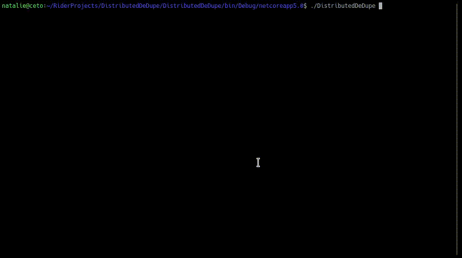

# DistributedDeDupe

This is a program that is used to distribute data across multiple storage systems.

# Demo



# Install

Run ./DistributedDeDupe once to setup the settings.

```
addstorage [location] [name]
ie
addstorage ./storage1 storage1
```

It will ask you a series of questions related to key generation.

Then it will give you a prompt. Typing help will show you the commands.

```
istributedDeDupe - program to deduplicate and encrypt files in cloud storage
Version: XXX
Commands:
ls - directory listing
ll - long directory listing (includes hash)
mkdir - make directory
cd - change directory
changekey - change the key in memory in case it was mistyped
showsettings - show settings
generate - generates a new settings file
*WARNING*
If you haven't backed up your settings file and overwrite the one you have
You will never be able to decrypt the files you have in remote storage
This is really just for testing or an initial setup
*WARNING*
put [file] - puts a file into the remote storage(s)
get [remote file] [local file] - gets a file, block by block, from the remote storage and places it in local file
localcat [file] - attempts to decrypt a file with the key in memory and output to console
remotecat [file] - downloads a remote file and attempts to decrypt a file with the key in memory and output to console
decryptdb [file] - this decrypts the db for manual inspection
addstorage [location] [name] - this adds a mounted physical location
fuse [location] - mounts a virtual file system at the specified location
```

The fuse support has not be rigorously but an rsync command worked:


```
rsync -T /tmp/rsback -azP . /tmp/test/back1
```

# Google Drive

~~Currently this works with google drive.~~

Google drive support has been shelved. It appears that the official library may not be that good - at least for uploading small files. Debugging their library is not that easy so I would need to write my own.

If you add multiple storage locations the backend will automatically mirror all chunks to each location. This is to satisfy the automatic healing goal.
Also if a storage system "goes away" the system will automatically attempt to try to pull the chunks it needs from other sources.

You will need to create an application with Google APIs to use this.

- Navigate to https://console.developers.google.com/
- Create new project
- Enable the google drive API (from member I think if you goto library on the left hand side, search for google drive, and enable)
- Go to credentials tab
- Click + Create Credentials
- Click OAuth client ID
- You can name it whatever you want
- Click on download JSON at the top
- Rename or save as  credentials.json
- Place in the same folder as the binary
- When you run the program for the first time it may spawn a web browser for you to login
- After you login it should prompt you for an auth key and it will tell you what to do with it
- After that it should prompt you for a key and place you into a CLI shell
- type `help` and you can take it from there

* The reason for these steps is that accessing google drive API is quota limited. I would rather not to have to worry about hitting a quota on my account.

# Version

As of this writing 0.3b

*As a result the usual disclaimers:*

This software may:

- Completely just not work
- Lose your data
- Tear a hole in the fabric of space time
- Create a black hole

Should not be required but per the license:

THE SOFTWARE IS PROVIDED "AS IS", WITHOUT WARRANTY OF ANY KIND, EXPRESS OR IMPLIED, INCLUDING BUT NOT LIMITED TO THE WARRANTIES OF MERCHANTABILITY, FITNESS FOR A PARTICULAR PURPOSE AND NONINFRINGEMENT. IN NO EVENT SHALL THE AUTHORS OR COPYRIGHT HOLDERS BE LIABLE FOR ANY CLAIM, DAMAGES OR OTHER LIABILITY, WHETHER IN AN ACTION OF CONTRACT, TORT OR OTHERWISE, ARISING FROM, OUT OF OR IN CONNECTION WITH THE SOFTWARE OR THE USE OR OTHER DEALINGS IN THE SOFTWARE.

# Motivation

This idea was actually in the back of my brain for several years. The original idea consisted of creating a deduplicating FUSE file system. In theory this is a great idea and has been done by many other people. Peter Odding created [http://peterodding.com/code/python/dedupfs/](such a system) in Python. There are some file systems that have it built in - [https://constantin.glez.de/2011/07/27/zfs-to-dedupe-or-not-dedupe/](such as ZFS). The problem with ZFS is that the deduplication doesn't scale - per the article you need 20GB of RAM per TB of data. If I have 6TB - I need 120GB of RAM. As a home user I simply do not have that hardware.

However, all of these projects rely on the underlying file disk. I recently lost a 6TB array and want to make sure that doesn't happen again.

# Goals

- Has to support any service (Google Drive and FTP being 2 targeted ones)
- Has to be self healing - in other words if it detects there is an issue - it alerts or attempts to repair
- There may be an agent but it MUST be usable agentless (many pieces of software require many components requiring hours of configuration)
- Has to be fast (that being said - obviously if data is stored externally your bandwidth and external resource will be the bottleneck)
- Data will be encrypted at rest
- Any new non-beta version can be automatically upgraded without manual intervention

Think of this as a distributed and deduplicated [https://github.com/vgough/encfs](encfs).

Files will be accessible via a CLI or mount*

* Mount may only be available on Linux via FUSE

# Design

I will use SQLite for the database backend - but file data will be stored in storage containers similar to a tarball. 

We will have to do stress tests to determine how the database will handle growth but I think it should be fine.

After doing some research - it seems to be best to use fixed block size deduplication. I will design the system to be able to leverage variable sized blocks but I think that would require programming knowledge of file types (or as wikipedia defines it - "content-aware data deduplication"). The fixed size should be specified by the user but default to 4096 byte blocks. Testing will need to be done if deduplication increases when we increase or decrease this value. I suspect the smaller the value the greater the deduplication but slower processing times.

Note to self:

Just encrypt the SQLite database - 

There is a DeleteOnClose option - which would work perfectly

```c#
using (FileStream fs = new FileStream(Path.GetTempFileName(),
       FileMode.OpenOrCreate, FileAccess.ReadWrite, FileShare.None,
       4096, FileOptions.RandomAccess | FileOptions.DeleteOnClose))
{
    // temp file exists
}
```

On *nix implementation they delete it in dispose because *nix doesn't offer this feature via the kernel - https://github.com/dotnet/runtime/blob/master/src/libraries/System.Private.CoreLib/src/System/IO/FileStream.Unix.cs#L269

(Windows kernel would handle the file deleting)

However, we can minimize the potential security risks by putting the file in /tmp and changing permissions. /tmp SHOULD (of course if some [https://superuser.com/questions/946054/preserving-tmp-on-reboot](system administrator) decides to change this DEFAULT behavior they are accepting the security consequences)

If malware gets root permission - then yes it would be able to read it but protecting against that is outside of the context of this application.

3/7/2021

I had originally stored each chunk as a file. Many file systems will choke on 1k or more files in a directory (ext4 seems to to pretty good and ntfs will handle it if you turn off 8+3 file naming). I did not want to store them via a directory hierarchy as that would make it even harder to move or backup/restore. So, I decided to use a zip file as the storage backing. This had work great for compression (it compressed a 40MB video file down to 2MB!), however, as my original fear that zip files cannot handle large number of files.

I have looked at libraries for key/value storage and all of them just seem too complicated for this project. I did not want to store the chunks in the database because I think that would balloon the database and I believe would cause the database to come to a crawl.

I imagined my own backend storage system that should prove to be pretty easy and efficent.

I have developed a very simple storage system that stores all blocks in a single file and stores the beginning and end positions in the database. This keeps the database contents down and it is very easy to "seek" in a file to that position.

# Theory

We will store Jenkins hash, then a SHA-512 of the block. And use those to determine if a duplicate block has been detected.

# License

The license, unless otherwise stated in a file, is under an MIT license.

# Projects Used

- Google.Apis.Drive.v3
- [https://github.com/bobvanderlinden/sharpfilesystem](sharpfilesystem)
- System.Data.SQLite

# Similar projects

- [https://linux.die.net/man/1/fdupes](fdupes)
- [https://github.com/vgough/encfs](encfs)
- [http://peterodding.com/code/python/dedupfs/](dedupefs)
